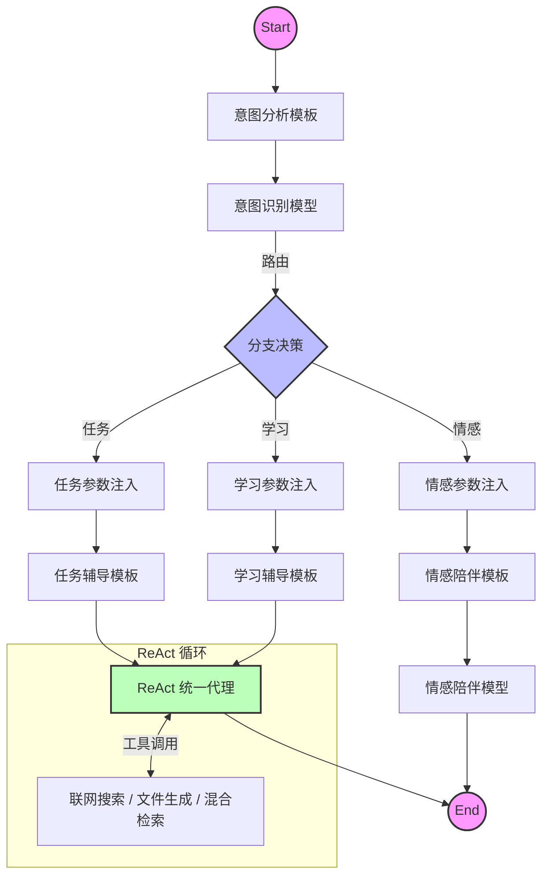

# StudyCoach - 基于大模型编排的智能教学辅助系统

<div align="center">


StudyCoach 是一个深度融合 **RAG (检索增强生成)** 与 **Agentic Workflow (智能体工作流)** 的全栈 AI 教学辅助平台。

不同于传统的"问答式" ChatBot，StudyCoach 采用基于图的编排引擎 (Graph Orchestration)，能够精准识别用户意图，动态路由至**情感陪伴**、**任务辅导**、**知识检索**或**工具调用**等不同处理分支，为学习者提供沉浸式、多模态的智能化服务。

**中文** | [English](README_EN.md)

[](https://golang.org/)
[](https://reactjs.org/)
[](https://github.com/cloudwego/eino)
[](https://x.ant.design/)
[](https://www.docker.com/)

</div>

---

## 🌟 核心亮点

### 🧠 智能体编排与多模态交互

- **图编排引擎 (Graph Orchestration)**: 基于字节跳动 `CloudWeGo/Eino` 框架，构建了复杂的有向无环图 (DAG) 业务流。
- **意图识别与动态路由**: 系统自动分析用户输入（"心情不好" vs "帮我解题"），智能分发至 **Emotion** (情感模型) 或 **Task** (任务模型) 分支。
- **ReAct 推理范式**: 实现了 Reasoning + Acting 模式，AI 具备"思考-行动-观察"闭环能力，可自主调用联网搜索或文件生成工具。
- **全双工语音交互**: 前端集成 **VAD (WebAssembly)** 实现毫秒级语音活动检测，配合后端 SSE 流式传输，达成"说话即打断"的自然对话体验。

### 📚 企业级 RAG 知识引擎

- **混合检索策略**: 结合 **Qdrant** (向量检索) 与 **Elasticsearch** (全文检索)，有效解决专业术语召回率低的问题。
- **全链路 ETL**: 内置 PDF/HTML/Word 解析器 (`Loader`) 与智能切片器 (`Splitter`)，自动构建高质量私有知识库。

### 🎨 沉浸式前端体验

- **Ant Design X 集成**: 采用蚂蚁金服最新的 AI 组件库，提供专业的思维链 (Chain of Thought) 展示与流式气泡交互。
- **多格式实时渲染**: 完美支持 **LaTeX 公式**、**Mermaid 流程图**、**代码高亮**及 **Markdown** 表格的实时流式渲染。

---

## 🏗️ 系统架构



## 🛠️ 技术栈

### 后端 (Backend)

- **语言**: Go 1.24
- **框架**: GoFrame v2 (Web), CloudWeGo/Eino (AI Orchestration)
- **数据库**: MySQL 8.0+, Redis
- **AI 基础设施**:
  - **向量库**: Qdrant / Elasticsearch 8
  - **对象存储**: SeaweedFS

### 前端 (Frontend)

- **框架**: React 19, TypeScript, Vite
- **UI/UX**: Ant Design 6, **Ant Design X** (AI Components)
- **AI 交互**:
  - **VAD**: `@ricky0123/vad-web` (端侧语音检测)
  - **Markdown**: `react-markdown`, `katex` (数学公式), `mermaid` (图表)
- **状态管理**: Redux Toolkit, React Router

---

## 📁 项目结构概览

```
studyCoach/
├── backend/                  # Go 后端服务
│   ├── internal/controller/  # 业务控制层 (GoFrame)
│   ├── studyCoach/           # AI 核心模块 (Eino)
│   │   ├── aiModel/          # 模型与编排逻辑
│   │   │   ├── CoachChat/    # 教学助手编排图
│   │   │   ├── asr/          # 语音识别模块
│   │   │   ├── indexer/      # RAG 索引构建器
│   │   │   └── retriever/    # 混合检索器
│   └── manifest/             # K8s/Docker 部署配置
│
├── frontChat/                # React 前端应用
│   ├── src/pages/AiChat/     # AI 对话核心页面
│   │   ├── components/       # 气泡、输入框等组件
│   │   └── hooks/            # useSSEChat, useVoiceService
│   └── src/services/         # API 接口封装
│
└── docker-compose.yml        # 容器化环境配置
```

## 🚀 快速开始

### 前置要求

- Go 1.24+
- Node.js 20+
- Bun 1.0+
- Docker & Docker Compose

### 1. 启动基础设施

```bash
docker-compose up -d
# 这将启动 MySQL, Redis, SeaweedFS, Qdrant, Elasticsearch
```

### 2. 启动后端

```bash
cd backend
# 复制并配置环境变量
cp .env.example .env
go mod tidy
go run main.go
```

### 3. 启动前端

```bash
cd frontChat
bun install
bun run dev
```

访问 `http://localhost:5173` 即可开始体验。

---

## 🔮 未来计划

### 📦 存储架构升级

- **SeaweedFS 迁移**: 已完成从 MinIO 到 SeaweedFS (Filer Mode) 的迁移，以支持更高效的小文件存储与目录管理。

### 🌐 MCP (Model Context Protocol) 生态集成

我们计划全面接入 **MCP 协议**，以实现更强大的工具互操作性：

- **标准化工具接口**: 将现有的 DuckDuckGo 搜索和文件生成工具迁移至标准 MCP Server。
- **跨应用上下文**: 允许 AI Agent 安全地访问本地开发环境、数据库或第三方 API，不仅限于简单的 Web 搜索。
- **插件化扩展**: 开发者可以通过编写 MCP Server 轻松为 StudyCoach 增加新的能力（如代码执行、日历管理等），无需修改核心代码。

### ⏰ 定时任务系统 (Cron) (进行中)

正在开发分布式定时任务调度与执行模块 (`backend/internal/controller/cron` & `cron_execute`)，旨在提供灵活的任务编排、状态追踪及后台作业处理能力。

---

## 🙏 致谢 (Acknowledgements)

本项目在 RAG (检索增强生成) 模块的实现过程中，深入参考并使用了以下开源项目的优秀设计：

* **[wangle201210/go-rag](https://github.com/wangle201210/go-rag)**: 感谢该项目在 Go 语言环境下 RAG 链路构建提供的宝贵思路与实现参考。
* **[wangle201210/chat-history](https://github.com/wangle201210/chat-history)**: 感谢该项目为 Eino 框架提供了便捷的聊天历史记录管理功能。

---

## 📄 许可证

[MIT License](LICENSE)
