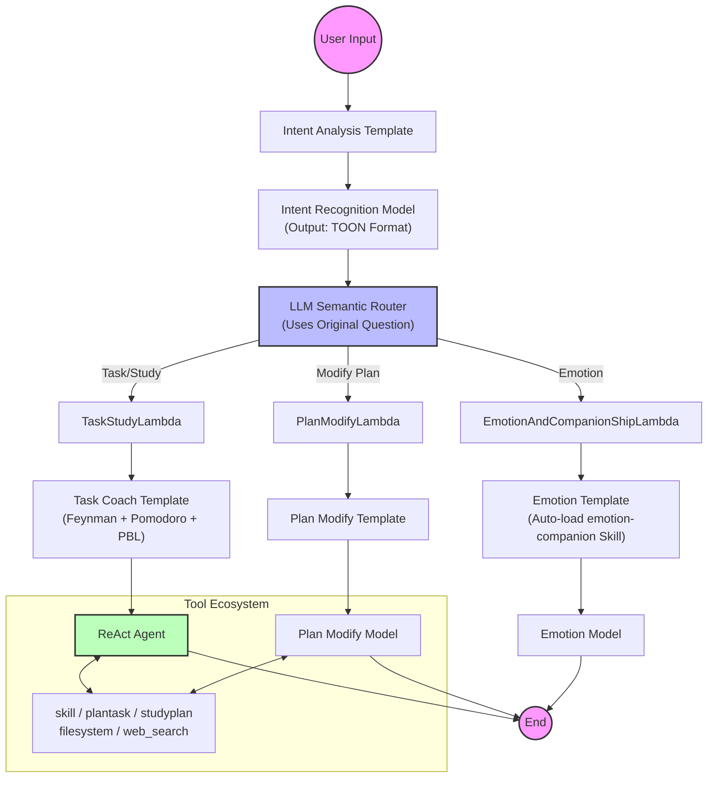

# StudyCoach - AI-Powered Learning Coach Platform

<div align="center">


StudyCoach is a full-stack AI learning coach platform that deeply integrates **RAG (Retrieval-Augmented Generation)** and **Agentic Workflow**, combining the Feynman Technique, Pomodoro Method, and PBL (Project-Based Learning) to provide immersive, companion-style learning experiences.

Unlike traditional "Q&A" ChatBots, StudyCoach employs a graph-based orchestration engine (Graph Orchestration) powered by ByteDance's Eino framework to precisely identify user intent and dynamically route requests to different processing branches such as **Emotional Companionship**, **Task Tutoring**, **Knowledge Retrieval**, or **Tool Invocation**.

**English Documentation** | [中文文档](README_ZH.md)

[](https://golang.org/)
[](https://reactjs.org/)
[](https://github.com/cloudwego/eino)
[](https://x.ant.design/)
[](https://www.docker.com/)

</div>

---

## 🌟 Key Highlights

### 🧠 Multi-Model Orchestration & LLM Semantic Routing
- **Graph Orchestration Engine**: Built on ByteDance's `CloudWeGo/Eino` framework with declarative DAG composition
- **LLM-Powered Semantic Routing**: Uses LLM for intent analysis and branch decision (not regex/keywords), understanding context-dependent queries like "change the plan" or "add a pomodoro"
- **Multi-Model Collaboration**: Different models for different purposes - intent analysis, routing, emotion, task tutoring, and teaching coach
- **ReAct Agent with Tools**: Implements Reasoning + Acting pattern with tool ecosystem (plantask, studyplan, filesystem, web search, skill loader)
- **Full-Duplex Voice Interaction**: Frontend VAD (WebAssembly) + backend SSE streaming for natural "interrupt-anytime" conversations

### 📚 Enterprise-Grade RAG with Triple Vector Engine
- **3-Engine Support**: Runtime-switchable between **Elasticsearch 8**, **Qdrant**, and **Milvus** via `vectorEngine` config
- **Advanced Retrieval Pipeline**: 3-round query rewriting + dual-path retrieval (content + QA vectors) + rerank + score filtering
- **MinerU PDF Parsing**: Precise PDF-to-Markdown conversion with OCR support before indexing
- **Auto-Update Knowledge Base**: Scheduled tasks with web search + knowledge pre-retrieval + AI generation (full/incremental modes)

### 🎨 Modern Frontend & Real-Time Features
- **Ant Design X Integration**: Professional AI component library with streaming bubble interactions and Chain of Thought display
- **Deep Thinking Mode**: Supports `reasoning_content` streaming output and persistence (NormalChat model)
- **WebSocket Push**: Real-time notifications for cron task completion using gorilla/websocket with Hub broadcast
- **Multi-Format Rendering**: LaTeX formulas, Mermaid diagrams, code highlighting, and Markdown tables in real-time streaming

---

## 🏗️ System Architecture

### CoachChat Multi-Branch Orchestration


```mermaid
graph TD
    Start(("User Input")) --> AnalysisTemplate["Intent Analysis Template"]
    AnalysisTemplate --> AnalysisModel["Intent Recognition Model<br/>(Output: TOON Format)"]

    AnalysisModel --> Branch["LLM Semantic Router<br/>(Uses Original Question)"]

    Branch -->|"Emotion"| EmotionLambda["EmotionAndCompanionShipLambda"]
    EmotionLambda --> EmotionTemplate["Emotion Template<br/>(Auto-load emotion-companion Skill)"]
    EmotionTemplate --> EmotionModel["Emotion Model"]
    EmotionModel --> End(("End"))

    Branch -->|"Task/Study"| TaskLambda["TaskStudyLambda"]
    TaskLambda --> TaskTemplate["Task Coach Template<br/>(Feynman + Pomodoro + PBL)"]
    TaskTemplate --> ReActAgent["ReAct Agent"]

    Branch -->|"Modify Plan"| PlanLambda["PlanModifyLambda"]
    PlanLambda --> PlanTemplate["Plan Modify Template"]
    PlanTemplate --> PlanModel["Plan Modify Model"]

    subgraph Tools ["Tool Ecosystem"]
        ReActAgent <--> ToolSet["skill / plantask / studyplan<br/>filesystem / web_search"]
        PlanModel <--> ToolSet
    end

    ReActAgent --> End
    PlanModel --> End

    style Start fill:#f9f,stroke:#333,stroke-width:2px
    style End fill:#f9f,stroke:#333,stroke-width:2px
    style Branch fill:#bbf,stroke:#333,stroke-width:2px
    style ReActAgent fill:#bfb,stroke:#333,stroke-width:2px
```

## 🛠️ Tech Stack

### Backend
- **Language**: Go 1.24
- **Framework**: GoFrame v2 (Web + ORM), CloudWeGo/Eino (AI Orchestration)
- **Database**: MySQL 8.0+, Redis (cache + session)
- **AI Infrastructure**:
  - **Vector DB**: Elasticsearch 8 / Qdrant / Milvus (runtime-switchable)
  - **Object Storage**: SeaweedFS (Filer mode)
  - **LLM**: Volcano Engine Ark / SiliconFlow / OpenAI-compatible
  - **PDF Parser**: MinerU (PDF-to-Markdown with OCR)
- **Task Scheduler**: robfig/cron v3 (second-level precision)
- **WebSocket**: gorilla/websocket (Hub broadcast for real-time push)

### Frontend
- **Framework**: React 19, TypeScript, Vite 7
- **UI/UX**: Ant Design 6, **Ant Design X** (AI Components), **@ant-design/x-sdk** (streaming)
- **Desktop**: Tauri (cross-platform)
- **AI Interaction**:
  - **VAD**: `@ricky0123/vad-web` (client-side voice detection)
  - **Markdown**: `react-markdown`, `katex` (formulas), `mermaid` (diagrams)
- **State Management**: Redux Toolkit, redux-persist, React Router
- **i18n**: react-i18next (Chinese/English)

---

## 📁 Project Structure

```
studyCoach/
├── backend/                      # Go Backend Service
│   ├── api/                      # API Definitions (GoFrame Req/Res)
│   │   ├── ai_chat/v1/           # Chat API
│   │   ├── rag/v1/               # Knowledge Base API
│   │   ├── cron/v1/              # Scheduled Tasks API
│   │   └── voice/v1/             # Voice API
│   ├── internal/
│   │   ├── controller/           # HTTP Controllers
│   │   ├── logic/                # Business Logic
│   │   ├── dao/                  # Data Access Layer
│   │   └── model/                # Data Models
│   ├── studyCoach/               # AI Core Module
│   │   ├── aiModel/              # AI Models & Orchestration
│   │   │   ├── CoachChat/        # Learning Coach (multi-branch)
│   │   │   ├── NormalChat/       # Normal Chat (single-chain ReAct)
│   │   │   ├── RegularUpdate/    # Scheduled Update
│   │   │   ├── eino_tools/       # Tool Ecosystem
│   │   │   │   ├── skill/        # Skill loader (SKILL.md)
│   │   │   │   ├── plantask/     # Task management tools
│   │   │   │   ├── studyplan/    # Study plan tools
│   │   │   │   └── filesystem/   # File operation tools
│   │   │   ├── indexer/          # RAG Indexing Pipeline
│   │   │   │   ├── es/           # Elasticsearch 8 indexer
│   │   │   │   ├── milvus/       # Milvus indexer
│   │   │   │   └── qdrant/       # Qdrant indexer
│   │   │   ├── mineruworker/     # MinerU PDF parser
│   │   │   ├── retriever/        # Hybrid Retrieval
│   │   │   └── asr/              # Voice Recognition
│   │   ├── api/                  # Internal APIs
│   │   ├── configTool/           # Config & DuckDuckGo
│   │   └── seaweedFS/            # File Storage Client
│   ├── skills/                   # Skill Documents (SKILL.md)
│   │   ├── plantask-usage/
│   │   ├── studyplan-usage/
│   │   ├── filesystem-usage/
│   │   └── emotion-companion/
│   └── manifest/
│       ├── config/config.yaml    # Main Config
│       └── deploy/kustomize/     # K8s Deployment
│
├── frontChat/                    # React Frontend
│   ├── src/pages/
│   │   ├── AiChat/               # AI Chat Page
│   │   ├── KnowledgeBase/        # Knowledge Base Management
│   │   ├── Cron/                 # Scheduled Tasks
│   │   └── Login/                # Authentication
│   ├── src/hooks/
│   │   ├── useSSEChat.ts         # SSE Streaming
│   │   ├── useWebSocket.ts       # WebSocket Client
│   │   └── useChatSettings.ts    # Chat Settings
│   └── src/services/             # API Services
│
├── ops/                          # DevOps Configuration
│   ├── monitoring/               # Prometheus + Grafana
│   ├── backup/                   # Backup Scripts
│   └── scripts/                  # Health Check Scripts
│
└── docker-compose.yml            # Infrastructure Services
```

## 🚀 Quick Start

### Prerequisites
- Go 1.24+
- Node.js 20+ / Bun 1.0+
- Docker & Docker Compose

### 1. Start Infrastructure Services
```bash
docker-compose up -d
# Starts: MySQL, Redis, SeaweedFS, Qdrant, Elasticsearch
```

### 2. Configure Backend
```bash
cd backend

# Copy and edit configuration
cp .env.example .env
# Edit .env to set:
# - Database credentials
# - AI API keys (Ark, SiliconFlow, OpenAI-compatible)
# - Redis password
# - Vector engine choice (es8/qdrant/milvus)
# - MinerU token (for PDF parsing)

# Install dependencies
go mod tidy
```

### 3. Start Backend Service
```bash
# Development mode
go run main.go

# Production build
go build -o studycoach main.go
./studycoach
```

Backend will start on `http://localhost:8000`

### 4. Start Frontend
```bash
cd frontChat

# Using Bun (recommended)
bun install
bun run dev

# Or using npm
npm install
npm run dev
```

Frontend will start on `http://localhost:5173`

### 5. (Optional) Deploy SenseVoice for ASR

For voice recognition features, deploy the **SenseVoice** service:

```bash
# Visit: https://github.com/FunAudioLLM/SenseVoice
# Follow installation guide, then:
python api.py
```

Configure the ASR endpoint in `backend/manifest/config/config.yaml`

---

## ✨ Core Features

### 🎯 Learning Coach System
- **Feynman Technique**: AI guides learners to explain concepts in simple terms
- **Pomodoro Method**: Built-in task timer and break management (plantask tools)
- **PBL (Project-Based Learning)**: Study plan creation and tracking (studyplan tools)
- **Anti-Loop Mechanism**: Prevents AI from repeating the same plan suggestions

### 🔧 Tool Ecosystem (eino_tools)
- **skill**: Dynamic SKILL.md loader for on-demand capability injection
- **plantask**: Task-level management (create/get/update/list tasks with pomodoro timers)
- **studyplan**: Plan-level management (save/read/delete study plans as Markdown)
- **filesystem**: Session-isolated file operations (read/write/execute within workspace)

### 📊 Knowledge Base Features
- **Multi-Engine Support**: Switch between ES8/Qdrant/Milvus via config
- **Dual-Vector Retrieval**: Content vector + QA vector for better recall
- **Auto-Update**: Scheduled tasks with web search + knowledge pre-retrieval + AI generation
- **Document Management**: Upload/delete/update documents and chunks with MySQL tracking

### 🔄 Real-Time Features
- **SSE Streaming**: Dual-path copy for client display + background persistence
- **WebSocket Push**: Real-time notifications for cron completion (gorilla/websocket Hub)
- **Deep Thinking**: Streaming `reasoning_content` output and persistence

---

## 🔮 Roadmap

### ✅ Completed
- ✅ SeaweedFS migration (from MinIO to Filer mode)
- ✅ MinerU PDF parsing integration (PDF-to-Markdown with OCR)
- ✅ Triple vector engine support (ES8/Qdrant/Milvus)
- ✅ Cron job system with WebSocket push
- ✅ Tool ecosystem (plantask/studyplan/filesystem/skill)
- ✅ Deep thinking mode with reasoning_content
- ✅ CI/CD pipelines (GitHub Actions)
- ✅ Monitoring stack (Prometheus + Grafana)

### 🚧 In Progress
- 🚧 Vector deletion consistency (sync MySQL chunk deletion with vector stores)
- 🚧 QA vector support for Qdrant/Milvus async indexing
- 🚧 Grader module integration for retrieval quality assessment

### 📋 Planned
- 📋 MCP (Model Context Protocol) ecosystem integration
- 📋 Multi-user workspace isolation
- 📋 Mobile app (React Native)
- 📋 Voice cloning for personalized TTS

---

## 🙏 Acknowledgements

This project references and utilizes excellent designs from the following open-source projects in the RAG module implementation:

- **[wangle201210/go-rag](https://github.com/wangle201210/go-rag)**: Valuable ideas and implementation references for building RAG pipelines in Go
- **[wangle201210/chat-history](https://github.com/wangle201210/chat-history)**: Convenient chat history management for the Eino framework

Special thanks to:
- **ByteDance CloudWeGo Team** for the Eino AI orchestration framework
- **OpenDataLab** for the MinerU PDF parsing SDK
- **Ant Design Team** for the Ant Design X AI component library

---

## 📄 License

[MIT License](LICENSE)

---

## 📚 Documentation

- [Architecture Documentation](ARCHITECTURE.md) - Detailed system architecture (Chinese)
- [API Documentation](http://localhost:8000/swagger) - OpenAPI/Swagger UI (after starting backend)
- [Files Layout](docs/FILES_LAYOUT.md) - Local directory conventions

---

## 🤝 Contributing

Contributions are welcome! Please feel free to submit a Pull Request.

1. Fork the repository
2. Create your feature branch (`git checkout -b feature/AmazingFeature`)
3. Commit your changes (`git commit -m 'Add some AmazingFeature'`)
4. Push to the branch (`git push origin feature/AmazingFeature`)
5. Open a Pull Request

---

## 📧 Contact

For questions or feedback, please open an issue on GitHub.

---

**Built with ❤️ using CloudWeGo/Eino, GoFrame, React, and Ant Design X**
