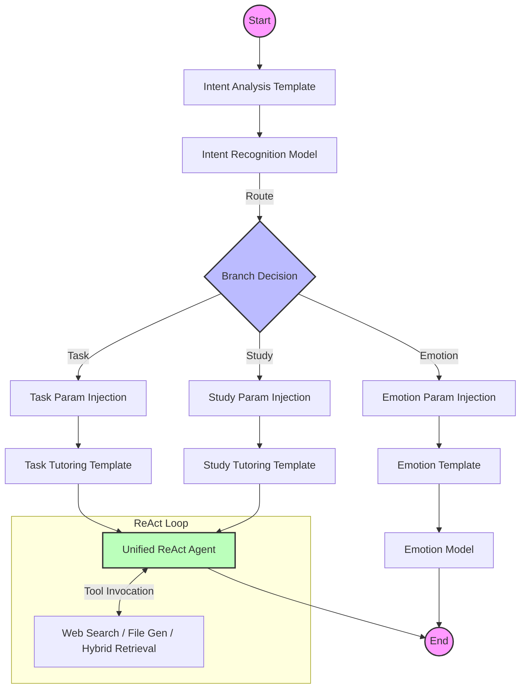

# StudyCoach - AI-Powered Intelligent Teaching Assistant System

<div align="center">


StudyCoach is a full-stack AI teaching assistant platform that deeply integrates **RAG (Retrieval-Augmented Generation)** and **Agentic Workflow**.

Unlike traditional "Q&A" ChatBots, StudyCoach employs a graph-based orchestration engine (Graph Orchestration) to precisely identify user intent and dynamically route requests to different processing branches such as **Emotional Companionship**, **Task Tutoring**, **Knowledge Retrieval**, or **Tool Invocation**, providing learners with immersive, multimodal intelligent services.

[中文文档](README.md) | **English Documentation**

[](https://golang.org/)
[](https://reactjs.org/)
[](https://github.com/cloudwego/eino)
[](https://x.ant.design/)
[](https://www.docker.com/)

</div>

---

## 🌟 Key Highlights

### 🧠 Agent Orchestration & Multimodal Interaction
- **Graph Orchestration Engine**: Built on ByteDance's `CloudWeGo/Eino` framework, constructing complex Directed Acyclic Graph (DAG) business flows.
- **Intent Recognition & Dynamic Routing**: Automatically analyzes user input (e.g., "feeling down" vs. "help me solve this problem") and intelligently dispatches to **Emotion** (Emotional Model) or **Task** (Task Model) branches.
- **ReAct Reasoning Paradigm**: Implements the Reasoning + Acting pattern, enabling AI with a "Think-Act-Observe" closed loop to autonomously invoke web search or file generation tools.
- **Full-Duplex Voice Interaction**: Frontend integrates **VAD (WebAssembly)** for millisecond-level voice activity detection, combined with backend SSE streaming to achieve a natural "interrupt-anytime" conversation experience.

### 📚 Enterprise-Grade RAG Knowledge Engine
- **Hybrid Retrieval Strategy**: Combines **Qdrant** (Vector Retrieval) and **Elasticsearch** (Full-Text Retrieval) to effectively solve low recall rates for specialized terminology.
- **Full-Link ETL**: Built-in PDF/HTML/Word parsers (`Loader`) and intelligent splitters (`Splitter`) to automatically construct high-quality private knowledge bases.

### 🎨 Immersive Frontend Experience
- **Ant Design X Integration**: Adopts Ant Financial's latest AI component library, providing professional Chain of Thought (CoT) display and streaming bubble interactions.
- **Multi-Format Real-Time Rendering**: Perfectly supports real-time streaming rendering of **LaTeX formulas**, **Mermaid flowcharts**, **Code highlighting**, and **Markdown** tables.

---

## 🏗️ System Architecture



## 🛠️ Tech Stack

### Backend
- **Language**: Go 1.24
- **Framework**: GoFrame v2 (Web), CloudWeGo/Eino (AI Orchestration)
- **Database**: MySQL 8.0+, Redis
- **AI Infrastructure**: 
  - **Vector DB**: Qdrant / Elasticsearch 8
  - **Object Storage**: MinIO

### Frontend
- **Framework**: React 19, TypeScript, Vite
- **UI/UX**: Ant Design 5, **Ant Design X** (AI Components)
- **AI Interaction**: 
  - **VAD**: `@ricky0123/vad-web` (Client-side Voice Detection)
  - **Markdown**: `react-markdown`, `katex` (Math Formulas), `mermaid` (Charts)
- **State Management**: Redux Toolkit, React Router

---

## 📁 Project Structure Overview

```
studyCoach/
├── backend/                  # Go Backend Service
│   ├── internal/controller/  # Business Control Layer (GoFrame)
│   ├── studyCoach/           # AI Core Module (Eino)
│   │   ├── aiModel/          # Model & Orchestration Logic
│   │   │   ├── CoachChat/    # Teaching Assistant Orchestration Graph
│   │   │   ├── asr/          # Speech Recognition Module
│   │   │   └── tools_node.go # MCP Tool Definitions
│   │   ├── indexer/          # RAG Index Builder
│   │   └── retriever/        # Hybrid Retriever
│   └── manifest/             # K8s/Docker Deployment Config
│
├── frontChat/                # React Frontend Application
│   ├── src/pages/AiChat/     # AI Chat Core Page
│   │   ├── components/       # Bubbles, Input Box Components
│   │   └── hooks/            # useSSEChat, useVoiceService
│   └── src/services/         # API Interface Encapsulation
│
└── docker/                   # Containerized Environment Config
```

## 🚀 Quick Start

### Prerequisites
- Go 1.24+
- Node.js 20+
- Docker & Docker Compose

### 1. Start Infrastructure
```bash
cd docker
docker-compose up -d
# This will start MySQL, Redis, MinIO, Qdrant, Elasticsearch
```

### 2. Start Backend
```bash
cd backend
# Copy and configure environment variables
cp .env.example .env
go mod tidy
go run main.go
```

### 3. Start Frontend
```bash
cd frontChat
npm install
npm run dev
```

Visit `http://localhost:5173` to start experiencing.

---

## 🔮 Future Plans

### 🌐 MCP (Model Context Protocol) Ecosystem Integration
We plan to fully integrate the **MCP Protocol** to achieve greater tool interoperability:
- **Standardized Tool Interfaces**: Migrate existing DuckDuckGo search and file generation tools to standard MCP Servers.
- **Cross-Application Context**: Allow AI Agents to securely access local development environments, databases, or third-party APIs, not limited to simple web searches.
- **Plugin Extensions**: Developers can easily add new capabilities (such as code execution, calendar management, etc.) to StudyCoach by writing MCP Servers without modifying the core code.

---

## 🙏 Acknowledgements

During the implementation of the RAG (Retrieval-Augmented Generation) module, this project deeply referenced and partially utilized the excellent design of the following open-source project:

*   **[wangle201210/go-rag](https://github.com/wangle201210/go-rag)**: Thanks to this project for providing valuable ideas and implementation references for building RAG links in the Go language environment.
*   **[wangle201210/chat-history](https://github.com/wangle201210/chat-history)**: Thanks to this project for providing convenient chat history management capabilities for the Eino framework.

---

## 📄 License

[MIT License](LICENSE)
