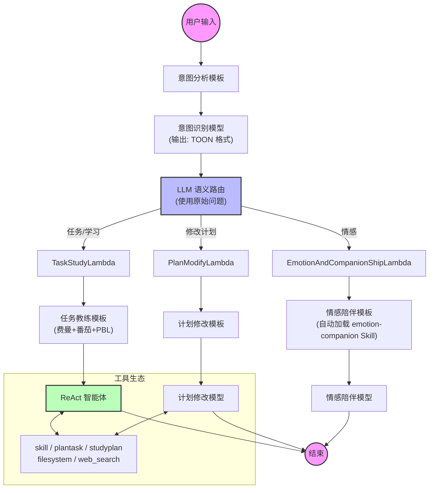

# StudyCoach - AI 驱动的学习教练平台

<div align="center">


StudyCoach 是一个深度融合 **RAG（检索增强生成）** 与 **Agentic Workflow（智能体工作流）** 的全栈 AI 学习教练平台，结合费曼学习法、番茄工作法与 PBL（项目制学习），提供沉浸式、陪伴式的学习体验。

不同于传统的"问答式" ChatBot，StudyCoach 采用字节跳动 Eino 框架驱动的图编排引擎（Graph Orchestration），精准识别用户意图，动态路由至**情感陪伴**、**任务辅导**、**知识检索**或**工具调用**等不同处理分支。

**中文** | [English](README.md)

[](https://golang.org/)
[](https://reactjs.org/)
[](https://github.com/cloudwego/eino)
[](https://x.ant.design/)
[](https://www.docker.com/)

</div>

---

## 🌟 核心亮点

### 🧠 多模型协作与 LLM 语义路由
- **图编排引擎**：基于字节跳动 `CloudWeGo/Eino` 框架的声明式 DAG 编排
- **LLM 语义路由**：使用 LLM 进行意图分析和分支决策（非正则/关键词），理解"修改计划""加番茄钟"等上下文相关查询
- **多模型协作**：不同模型各司其职——意图分析、路由、情感、任务辅导、教学教练
- **ReAct 智能体与工具**：实现推理+行动模式，配备工具生态（plantask、studyplan、filesystem、联网搜索、技能加载器）
- **全双工语音交互**：前端 VAD（WebAssembly）+ 后端 SSE 流式传输，实现"随时打断"的自然对话

### 📚 企业级 RAG 与三引擎向量存储
- **三引擎支持**：通过 `vectorEngine` 配置在 **Elasticsearch 8**、**Qdrant** 和 **Milvus** 之间运行时切换
- **高级检索管线**：3 轮查询重写 + 双路检索（内容向量 + QA 向量）+ 重排 + 分数过滤
- **MinerU PDF 解析**：索引前进行精准的 PDF 转 Markdown 转换，支持 OCR
- **知识库自动更新**：定时任务配合联网搜索 + 知识预检索 + AI 生成（全量/增量模式）

### 🎨 现代化前端与实时特性
- **Ant Design X 集成**：专业的 AI 组件库，支持流式气泡交互和思维链展示
- **深度思考模式**：支持 `reasoning_content` 流式输出与持久化（NormalChat 模型）
- **WebSocket 推送**：使用 gorilla/websocket 的 Hub 广播实现定时任务完成的实时通知
- **多格式渲染**：实时流式渲染 LaTeX 公式、Mermaid 图表、代码高亮和 Markdown 表格

---

## 🏗️ 系统架构

### CoachChat 多分支编排



## 🛠️ 技术栈

### 后端
- **语言**：Go 1.24
- **框架**：GoFrame v2（Web + ORM）、CloudWeGo/Eino（AI 编排）
- **数据库**：MySQL 8.0+、Redis（缓存 + 会话）
- **AI 基础设施**：
  - **向量库**：Elasticsearch 8 / Qdrant / Milvus（运行时可切换）
  - **对象存储**：SeaweedFS（Filer 模式）
  - **LLM**：火山引擎 Ark / SiliconFlow / OpenAI 兼容
  - **PDF 解析**：MinerU（PDF 转 Markdown，支持 OCR）
- **任务调度**：robfig/cron v3（秒级精度）
- **WebSocket**：gorilla/websocket（Hub 广播实时推送）

### 前端
- **框架**：React 19、TypeScript、Vite 7
- **UI/UX**：Ant Design 6、**Ant Design X**（AI 组件）、**@ant-design/x-sdk**（流式请求）
- **桌面端**：Tauri（跨平台）
- **AI 交互**：
  - **VAD**：`@ricky0123/vad-web`（端侧语音检测）
  - **Markdown**：`react-markdown`、`katex`（公式）、`mermaid`（图表）
- **状态管理**：Redux Toolkit、redux-persist、React Router
- **国际化**：react-i18next（中英双语）

---

## 📁 项目结构

```
studyCoach/
├── backend/                      # Go 后端服务
│   ├── api/                      # API 定义（GoFrame Req/Res）
│   │   ├── ai_chat/v1/           # 对话 API
│   │   ├── rag/v1/               # 知识库 API
│   │   ├── cron/v1/              # 定时任务 API
│   │   └── voice/v1/             # 语音 API
│   ├── internal/
│   │   ├── controller/           # HTTP 控制器
│   │   ├── logic/                # 业务逻辑
│   │   ├── dao/                  # 数据访问层
│   │   └── model/                # 数据模型
│   ├── studyCoach/               # AI 核心模块
│   │   ├── aiModel/              # AI 模型与编排
│   │   │   ├── CoachChat/        # 学习教练（多分支）
│   │   │   ├── NormalChat/       # 普通对话（单链 ReAct）
│   │   │   ├── RegularUpdate/    # 定时更新
│   │   │   ├── eino_tools/       # 工具生态
│   │   │   │   ├── skill/        # 技能加载器（SKILL.md）
│   │   │   │   ├── plantask/     # 任务管理工具
│   │   │   │   ├── studyplan/    # 学习计划工具
│   │   │   │   └── filesystem/   # 文件操作工具
│   │   │   ├── indexer/          # RAG 索引管线
│   │   │   │   ├── es/           # Elasticsearch 8 索引器
│   │   │   │   ├── milvus/       # Milvus 索引器
│   │   │   │   └── qdrant/       # Qdrant 索引器
│   │   │   ├── mineruworker/     # MinerU PDF 解析
│   │   │   ├── retriever/        # 混合检索
│   │   │   └── asr/              # 语音识别
│   │   ├── api/                  # 内部 API
│   │   ├── configTool/           # 配置与 DuckDuckGo
│   │   └── seaweedFS/            # 文件存储客户端
│   ├── skills/                   # 技能文档（SKILL.md）
│   │   ├── plantask-usage/
│   │   ├── studyplan-usage/
│   │   ├── filesystem-usage/
│   │   └── emotion-companion/
│   └── manifest/
│       ├── config/config.yaml    # 主配置
│       └── deploy/kustomize/     # K8s 部署
│
├── frontChat/                    # React 前端
│   ├── src/pages/
│   │   ├── AiChat/               # AI 对话页面
│   │   ├── KnowledgeBase/        # 知识库管理
│   │   ├── Cron/                 # 定时任务
│   │   └── Login/                # 认证
│   ├── src/hooks/
│   │   ├── useSSEChat.ts         # SSE 流式
│   │   ├── useWebSocket.ts       # WebSocket 客户端
│   │   └── useChatSettings.ts    # 聊天设置
│   └── src/services/             # API 服务
│
├── ops/                          # 运维配置
│   ├── monitoring/               # Prometheus + Grafana
│   ├── backup/                   # 备份脚本
│   └── scripts/                  # 健康检查脚本
│
└── docker-compose.yml            # 基础设施服务
```

## 🚀 快速开始

### 前置要求
- Go 1.24+
- Node.js 20+ / Bun 1.0+
- Docker & Docker Compose

### 1. 启动基础设施服务
```bash
docker-compose up -d
# 启动：MySQL、Redis、SeaweedFS、Qdrant、Elasticsearch
```

### 2. 配置后端
```bash
cd backend

# 复制并编辑配置
cp .env.example .env
# 编辑 .env 设置：
# - 数据库凭证
# - AI API 密钥（Ark、SiliconFlow、OpenAI 兼容）
# - Redis 密码
# - 向量引擎选择（es8/qdrant/milvus）
# - MinerU token（用于 PDF 解析）

# 安装依赖
go mod tidy
```

### 3. 启动后端服务
```bash
# 开发模式
go run main.go

# 生产构建
go build -o studycoach main.go
./studycoach
```

后端将在 `http://localhost:8000` 启动

### 4. 启动前端
```bash
cd frontChat

# 使用 Bun（推荐）
bun install
bun run dev

# 或使用 npm
npm install
npm run dev
```

前端将在 `http://localhost:5173` 启动

### 5. （可选）部署 SenseVoice 语音识别

如需语音识别功能，请部署 **SenseVoice** 服务：

```bash
# 访问：https://github.com/FunAudioLLM/SenseVoice
# 按照安装指南操作，然后：
python api.py
```

在 `backend/manifest/config/config.yaml` 中配置 ASR 端点

---

## ✨ 核心特性

### 🎯 学习教练系统
- **费曼学习法**：AI 引导学习者用简单语言解释概念
- **番茄工作法**：内置任务计时器和休息管理（plantask 工具）
- **PBL 项目制学习**：学习计划创建与跟踪（studyplan 工具）
- **反循环机制**：防止 AI 重复输出相同的计划建议

### 🔧 工具生态（eino_tools）
- **skill**：动态 SKILL.md 加载器，按需注入能力
- **plantask**：任务级管理（创建/获取/更新/列出任务，含番茄钟）
- **studyplan**：计划级管理（保存/读取/删除学习计划为 Markdown）
- **filesystem**：会话隔离的文件操作（工作区内读/写/执行）

### 📊 知识库功能
- **多引擎支持**：通过配置在 ES8/Qdrant/Milvus 之间切换
- **双向量检索**：内容向量 + QA 向量，提升召回率
- **自动更新**：定时任务配合联网搜索 + 知识预检索 + AI 生成
- **文档管理**：上传/删除/更新文档和分块，MySQL 跟踪

### 🔄 实时特性
- **SSE 流式**：双路复制用于客户端展示 + 后台持久化
- **WebSocket 推送**：定时任务完成的实时通知（gorilla/websocket Hub）
- **深度思考**：流式 `reasoning_content` 输出与持久化

---

## 🔮 发展路线

### ✅ 已完成
- ✅ SeaweedFS 迁移（从 MinIO 到 Filer 模式）
- ✅ MinerU PDF 解析集成（PDF 转 Markdown，支持 OCR）
- ✅ 三引擎向量存储支持（ES8/Qdrant/Milvus）
- ✅ 定时任务系统与 WebSocket 推送
- ✅ 工具生态（plantask/studyplan/filesystem/skill）
- ✅ 深度思考模式与 reasoning_content
- ✅ CI/CD 流水线（GitHub Actions）
- ✅ 监控栈（Prometheus + Grafana）
- ✅ 向量删除一致性（同步 MySQL chunk 删除与向量库）
- ✅ Qdrant/Milvus 异步索引的 QA 向量支持
- ✅ Grader 模块集成用于检索质量评估

### 🚧 进行中

### 📋 计划中
- 📋 MCP（模型上下文协议）生态集成
- 📋 多用户工作区隔离
- 📋 移动应用（React Native）
- 📋 语音克隆用于个性化 TTS

---

## 🙏 致谢

本项目在 RAG 模块实现过程中，深入参考并使用了以下开源项目的优秀设计：

- **[wangle201210/go-rag](https://github.com/wangle201210/go-rag)**：在 Go 语言环境下 RAG 链路构建提供的宝贵思路与实现参考
- **[wangle201210/chat-history](https://github.com/wangle201210/chat-history)**：为 Eino 框架提供了便捷的聊天历史记录管理功能

特别感谢：
- **字节跳动 CloudWeGo 团队**提供的 Eino AI 编排框架
- **OpenDataLab** 提供的 MinerU PDF 解析 SDK
- **Ant Design 团队**提供的 Ant Design X AI 组件库

---

## 📄 许可证

[MIT License](LICENSE)

---

## 📚 文档

- [架构文档](ARCHITECTURE.md) - 详细的系统架构说明（中文）
- [API 文档](http://localhost:8000/swagger) - OpenAPI/Swagger UI（启动后端后访问）
- [文件布局](docs/FILES_LAYOUT.md) - 本地目录约定

---

## 🤝 贡献

欢迎贡献！请随时提交 Pull Request。

1. Fork 本仓库
2. 创建特性分支（`git checkout -b feature/AmazingFeature`）
3. 提交更改（`git commit -m 'Add some AmazingFeature'`）
4. 推送到分支（`git push origin feature/AmazingFeature`）
5. 开启 Pull Request

---

## 📧 联系方式

如有问题或反馈，请在 GitHub 上提交 issue。

---

**使用 ❤️ 构建，基于 CloudWeGo/Eino、GoFrame、React 和 Ant Design X**
